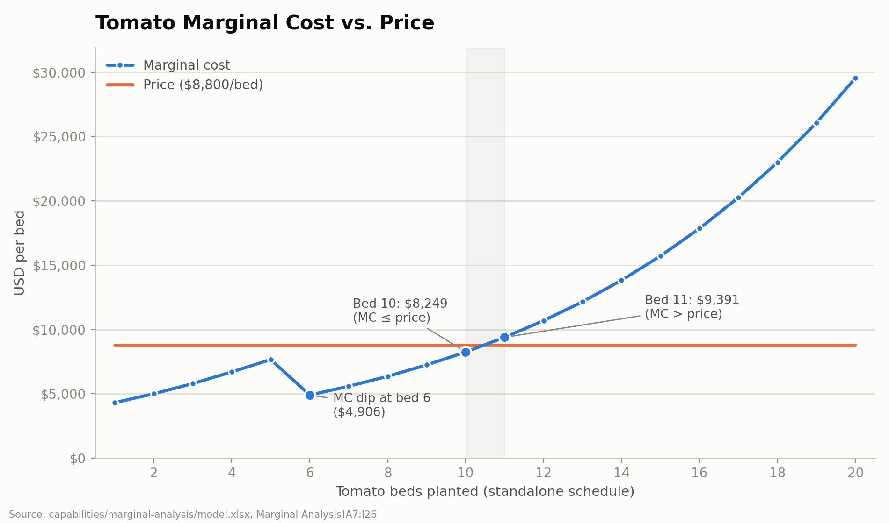
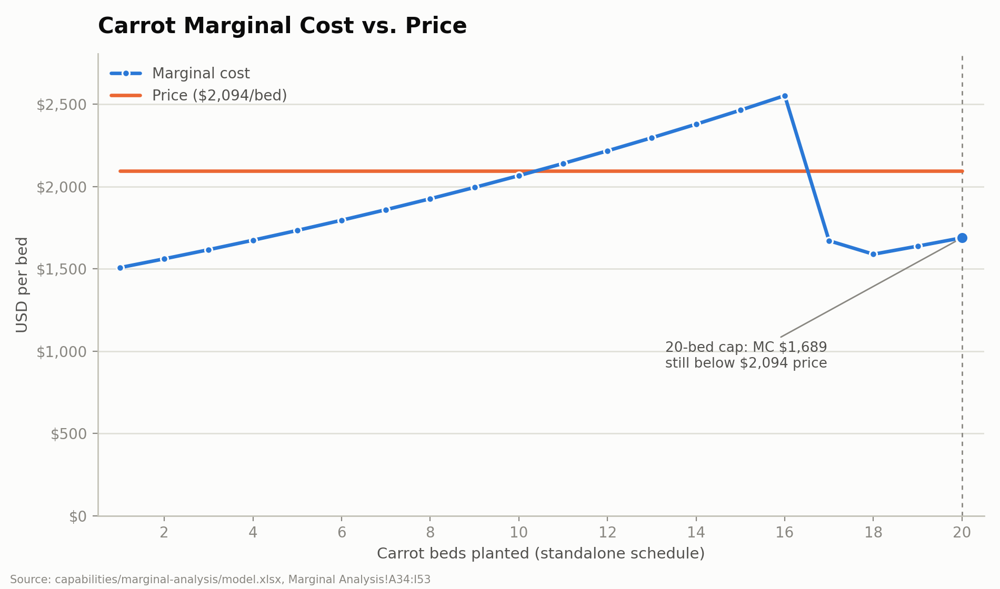

# Perfect Competition — Stage 3 Analysis

## 1. Why tomatoes stop at 10 beds

Tomatoes remain profitable at the margin through bed 10. At bed 10, the tomato price is $8,800 (Marginal Analysis!I16) and the marginal cost is $8,248.59 (Marginal Analysis!H16), leaving a marginal contribution of $551.41. However, the marginal cost rises to $9,390.72 at bed 11 (Marginal Analysis!H17), which is greater than the $8,800 price. Therefore, the farmer stops at 10 beds because the eleventh bed would reduce profit. This can also be seen in the tomato marginal-cost chart below.

## 2. Which constraints bind and what relaxing them is worth

Carrot and mesclun bed constraints are binding because the optimized plan uses their full limits: 20 carrot beds and 30 mesclun beds (Optimization!B25:D25 and Optimization!B27:D27). At the caps, carrot marginal cost is $1,688.95 compared with a $2,094 price, while mesclun marginal cost is $2,420.10 compared with a $2,700 price; both remain below price at their caps (Marginal Analysis!H53/I53 and H90/I90). The tomato-cap, total-bed, and temporary-worker constraints are slack because the optimized plan is below their limits (Optimization!B23:D23, Optimization!B28:D28, and Optimization!B29:D29). Because these constraints are slack, relaxing them would not increase profit under the current plan, so their shadow prices are $0. Relaxing a constraint means increasing its maximum by one bed and rerunning Solver. When the carrot cap increased from 20 to 21 beds, optimized profit increased by $352.49. Increasing the mesclun cap from 30 to 31 beds increased profit by $246.47. Because the carrot cap has the larger shadow price, I would relax the carrot constraint first. I calculated these shadow prices by changing each cap in the workbook, rerunning Solver, and comparing the new profit to the original optimized profit of $42,761.66 (Optimization!B11).

The path to that cap is not monotonic, and the carrot chart below shows it. Carrot marginal cost rises above the $2,094 price from bed 11 through bed 16, climbing from $2,140.11 to a peak of $2,552.10 (Marginal Analysis!H44:H49). It then falls back to $1,670.90 at bed 17 (Marginal Analysis!H50), because the farmer's 720 field hours are exhausted at that point and cheaper temporary labor begins covering the additional work (Marginal Analysis!C49:D50), the same mechanism described for tomatoes in Section 3. Marginal cost stays below price from bed 17 through the cap. This does not change the plan: at bed 20 marginal cost is $1,688.95 against the $2,094 price, so it is the 20-bed cap rather than marginal cost that stops carrot production.

## 3. Why tomato marginal cost dips around bed 6

Tomato marginal cost dips around bed 6 because the farmer’s more expensive labor reaches its available limit at $34.72 per hour (Inputs!B11), and cheaper temporary labor begins covering the additional labor needed at $17.36 per hour (Inputs!B15). The labor-hour shift is visible at the 720-hour boundary. At bed 5, total tomato labor is 724.73 hours (Marginal Analysis!B11): the farmer’s 720 field hours are fully used (Marginal Analysis!C11) and only 4.73 hours fall to temporary labor (Marginal Analysis!D11). At bed 6, total labor rises to 956.64 hours (Marginal Analysis!B12), the farmer’s contribution stays fixed at 720 (Marginal Analysis!C12), and temporary hours rise to 236.64 (Marginal Analysis!D12). Every additional labor hour past bed 5 is therefore billed at the temporary rate rather than the farmer’s. This causes marginal cost to fall from $7,660.86 at bed 5 (Marginal Analysis!H11) to $4,906.28 at bed 6 (Marginal Analysis!H12). This relationship can also be seen in the tomato marginal-cost chart shown in Section 1.

## 4. Why grow crops that appear unprofitable alone?

Carrots and mesclun may appear unprofitable when the entire farm fixed cost of $20,000 is assigned to each crop separately. However, the short-run decision should compare price with average variable cost. At the selected quantities, carrot price is $2,094 (Marginal Analysis!I53) compared with AVC of $1,918.45, calculated as variable cost of $38,368.92 divided by 20 beds (Marginal Analysis!G53 ÷ A53). Mesclun price is $2,700 (Marginal Analysis!I90) compared with AVC of $2,430.74, calculated as variable cost of $72,922.19 divided by 30 beds (Marginal Analysis!G90 ÷ A90). Because price exceeds AVC at these quantities, each additional bed covers its variable production cost and contributes toward the farm’s unavoidable fixed cost.

Price does not exceed AVC at every quantity, however. Mesclun AVC rises above its $2,700 price at beds 13 and 14, reaching $2,716.35 and $2,702.51 (Marginal Analysis!G73 ÷ A73 and G74 ÷ A74), before falling back below price from bed 15 onward. The optimized plan selects 30 mesclun beds, where AVC is $2,430.74, so the short-run conclusion for the selected plan is unchanged — but the claim holds at the quantities actually planted, not at every quantity on the schedule.

Therefore, the optimizer grows both crops to their allowed limits even though assigning the full fixed cost to each crop makes their individual ATC appear higher than price.

## 5. Revisit the Stage 1 hypothesis

My original hypothesis predicted 20 carrot beds, 30 mesclun beds, and 14 tomato beds (docs/briefs/perfect-competition-brief.md). The optimized result was 20 carrot beds, 30 mesclun beds, and 10 tomato beds (Optimization!B6:B8). I correctly predicted the carrot and mesclun caps, but I overestimated tomato production by four beds. The error came from assuming tomatoes’ high price justified continuing production without comparing each bed’s marginal cost with its price. At bed 11, tomato marginal cost was $9,390.72 (Marginal Analysis!H17) compared with a price of $8,800, and the later beds remained above price. The model showed me that maximizing the number of beds is not the same as maximizing profit.

I understand that total labor costs generally increase as the number of beds increases because tending more beds requires more labor, time, and physical effort. However, marginal cost does not always increase smoothly. In Section 3, tomato marginal cost falls between beds 5 and 6 because cheaper temporary labor begins covering the additional work. This distinction helped me understand that total costs can rise while the cost of producing one additional bed can temporarily fall. In this model, time and labor are money.
