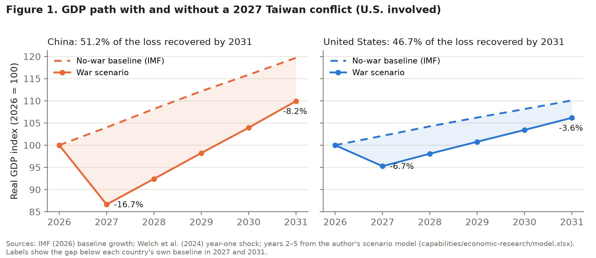
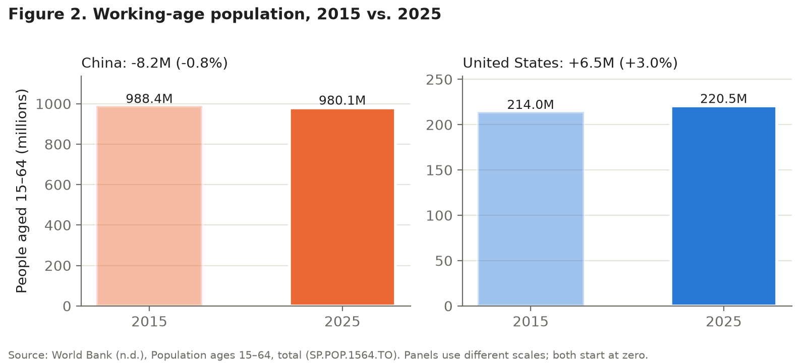

# China's Aging Workforce and Recovery After a Taiwan Shock

Michelle Buff · ECON 620 Individual Research Paper · Draft, October 8, 2026

## The Challenge

China's shrinking, aging working-age population—980 million people aged 15–64 in 2025, down 8.2 million since 2015 (World Bank, n.d.)—could make state-directed stimulus less effective (Chen et al., 2025). That stimulus supported China's 2008 recovery (Yueh, 2010), while its post-COVID rebound also reflected reopened services and stronger consumption (International Monetary Fund [IMF], 2024). The question is not whether Beijing can still spend, but whether each yuan of credit restores less output as workers become scarcer (Chen et al., 2025) and pension obligations compete for fiscal room (Bonthuis et al., 2026).

Beijing claims Taiwan as part of China, opposes Taiwanese independence, and says it prefers peaceful unification while keeping the option of force open (Office of the Director of National Intelligence [ODNI], 2026; Taiwan Affairs Office & State Council Information Office, 2022). Taiwan is self-governing, and the People's Republic of China has never governed it (Curtis, 2025).

A cross-strait conflict has been a concern for decades (Curtis, 2025). Some analysts argue that China's declining population and rising pension obligations could make Beijing feel pressure to act within the next decade (Agee, 2025; Brands & Beckley, 2022)—but that is a theory about a possible "closing window," not a settled forecast. The often-cited 2027 date concerns military readiness, not a confirmed invasion date; 2035 is also China's target for basic military modernization (LaGrone, 2021). The latest U.S. intelligence assessment says China has no fixed timeline for unification with Taiwan (ODNI, 2026; see also Liang, 2026).

If a conflict occurred and the United States became involved (as in the war scenario modeled by Welch et al., 2024), what would the economic costs be for both countries, and how would each recover during years 2–5 after the initial shock?

I am writing this report for the U.S. Department of Commerce, specifically the Bureau of Industry and Security, to prepare for the outcome of a potential Taiwan conflict and how it could impact the U.S. economy. A conflict will impact the economy, but it will also impact the U.S. tech industry directly and indirectly, and we should be prepared for it. The decision in front of BIS is whether to extend export controls beyond frontier AI chips to the industrial AI chips that run factory automation.

## Hypothesis

My hypothesis: following a Taiwan-conflict shock, China would remain further below its own no-conflict GDP path in years 2–5 than the United States would relative to its own baseline — a recovery-speed gap distinct from, and not explained by, any difference in the size of the initial year-one hit.

**How I would know I was wrong:** in years 2–5, China's output gap relative to its own no-conflict baseline closes at a pace similar to or faster than the U.S.'s — meaning state-directed stimulus still restores output effectively despite the smaller, older workforce behind it.

## Method

Because the conflict estimates cover year one, I treated years 2–5 as a scenario, starting from the initial hit and reasoning through stimulus, labor, pension, fiscal, and trade effects against each country's IMF no-war baseline (IMF, 2026).

The scenario model (capabilities/economic-research/model.xlsx) starts each country at its year-one shortfall in 2027, applies the same stimulus rule to both countries (5% of GDP per 10 points of year-one loss), and scales each country's stimulus effect by an aging penalty and the change in its working-age population. For the same U.S.-involved war scenario, it compares what share of each country's year-one GDP loss has been recovered by year five relative to its own baseline.

## Findings

### What the model found

In the model, China closes 51.2% of its year-one gap by 2031 (Recovery!B7), compared with 46.7% for the United States (Recovery!C7). Despite its aging population, China recovers a larger share of its initial output loss in this scenario. The scenario assumes a 2027 conflict in which the United States becomes involved, using Welch et al.'s (2024) estimates of each country's year-one output shortfall relative to its no-war path: −16.7% for China and −6.7% for the United States. My hypothesis was that population aging would reduce the effectiveness of China's stimulus, leaving China further below its no-war path than the United States in years 2–5. This result triggers the falsification condition stated in my brief.

### Why China recovers a larger share

China recovers a larger share because, in the model, its stimulus remains more effective than the U.S. response, and that advantage outweighs the drag from its shrinking working-age population. China's stimulus effectiveness is 0.682 (Scenario!B6): a 30% aging penalty (Chen et al., 2025) combined with a 2.6% decline in its working-age population between 2027 and 2031 (World Bank, 2026). The U.S. figure is 0.623 (Scenario!C6): a larger 38% aging penalty (Basso & Rachedi, 2021), only partly offset by 0.5% growth in its working-age population over the same period. Because stimulus is scaled to each country's year-one loss, the size of the initial shock cancels out, and the comparison rests entirely on these two effectiveness values (Figure 2).

One important caution: the 30% penalty for China comes from research on monetary stimulus (Chen et al., 2025), while the model applies it to fiscal stimulus. The two are not interchangeable. IMF research supports the broader link between population aging and weaker fiscal multipliers (Honda & Miyamoto, 2020), but not this specific country-level adjustment.

### How close the result is

The verdict would reverse if China's assumed aging penalty rose from 30% to approximately 36.1% (Sensitivity!B30), or if the U.S. penalty fell from 38% to approximately 32.1% (Sensitivity!B32). Shifts of about six percentage points are well within the uncertainty of the underlying estimates: Chen et al. (2025) report China's penalty as a lower bound ("30%+"), and Honda and Miyamoto (2020) establish the direction of the aging effect but not its size. The result is therefore sensitive to the aging penalties and should not be treated as definitive. It is less sensitive to the workforce input: China's working-age population would need to fall to about 876 million by 2031 (Sensitivity!B33), well below the World Bank projection of 959 million (World Bank, 2026), and using 2015–2025 workforce data instead gives the same verdict (52.1% versus 47.9%).

### What the model does not measure

Readers should not interpret China's higher recovery percentage as evidence that it suffers less economic damage, or that workforce decline and export restrictions are unimportant. The model measures recovery relative to each country's initial loss, not the size of that loss. In 2031, China's output is still 8.2% below its no-war path (Recovery!B6), compared with 3.6% for the United States (Recovery!C6). The results also depend on uncertain fiscal assumptions: the effect of stimulus on output (about 1.5 percentage points of medium-run output loss avoided per 1% of GDP of extra government consumption) is drawn from banking crises rather than wars, measured seven years after the crisis rather than five, and is an association rather than a causal estimate (Abiad et al., 2009, p. 23), and years 2–5 are a reasoned scenario because no published model covers them. Finally, the model does not directly measure the effects of semiconductor export controls or pension obligations; both channels are discussed as written argument, so none of the modeled gap should be attributed to them.

### Revisiting the hypothesis

I predicted that the United States would recover a larger share of its year-one loss than China in the five years after the conflict. The model triggered the falsifier I committed in my brief before running any analysis: China recovers the larger share. I also wrote down, before locking the specification, that early test runs showed the result was sensitive to the U.S. aging penalty; I kept that penalty on its merits rather than adjusting it after seeing the outcome (spec, Process Note). The larger lesson is that recovery depends on many interacting factors. An aging workforce is only one of them, and in this model it is outweighed by differences in how effectively each economy's stimulus translates into output.

## Recommendation for BIS

BIS should consider a targeted approach to industrial AI chip export controls rather than broad restrictions justified solely by expectations about China's economic recovery. The model suggests that China could recover a larger share of its initial GDP loss despite a shrinking workforce, although it would remain further below its no-war path than the United States (Recovery!B6, C6). For U.S. planners, the implication is that China's demographic decline should not be counted on to slow its post-conflict recovery. Because the results are sensitive to assumptions about stimulus effectiveness and do not directly measure semiconductor export restrictions, BIS should evaluate the specific national security risks, industrial productivity implications, and potential for Chinese technological substitution before expanding controls beyond the frontier AI chips already restricted since October 2022 (Curtis, 2025).

## References

Abiad, A., Balakrishnan, R., Brooks, P. K., Leigh, D., & Tytell, I. (2009). *What's the damage? Medium-term output dynamics after banking crises* (IMF Working Paper No. 09/245). International Monetary Fund. https://doi.org/10.5089/9781451873924.001

Agee, R. (2025, October 2). *China's closing window: Strategic compression and the risk of crisis*. Foreign Policy Research Institute. https://www.fpri.org/article/2025/10/chinas-closing-window-strategic-compression-and-the-risk-of-crisis/

Basso, H. S., & Rachedi, O. (2021). The young, the old, and the government: Demographics and fiscal multipliers. *American Economic Journal: Macroeconomics, 13*(4), 110–141. https://doi.org/10.1257/mac.20190174

Bonthuis, B., Cao, Y., & Freudenberg, C. (2026). *Population aging and pension reforms in China* (IMF Working Paper No. WP/26/27). International Monetary Fund. https://www.imf.org/en/publications/wp/issues/2026/02/19/population-aging-and-pension-reforms-in-china-574061

Brands, H., & Beckley, M. (2022). *Danger zone: The coming conflict with China*. W. W. Norton.

Chen, X., Guo, J., & Zhang, J. (2025). How does aging population affect China's monetary policy effectiveness: Empirical evidence and theoretical analysis. *Economic Modelling, 152*, Article 107309. https://doi.org/10.1016/j.econmod.2025.107309

Curtis, J. (2025). *Taiwan: Relations with the United States* (Research Briefing No. 9265). House of Commons Library. https://commonslibrary.parliament.uk/research-briefings/cbp-9265/

Honda, J., & Miyamoto, H. (2020). *Would population aging change the output effects of fiscal policy?* (IMF Working Paper No. 20/92). International Monetary Fund. https://doi.org/10.5089/9781513537313.001

International Monetary Fund. (2026, April). *World economic outlook: Global economy in the shadow of war* [Statistical appendix, Tables A1, A2, and A4]. https://www.imf.org/-/media/files/publications/weo/2026/april/english/tablea.pdf

International Monetary Fund. (2024, February 2). *IMF Executive Board concludes 2023 Article IV consultation with the People's Republic of China* (Press Release No. 24/33). https://www.imf.org/en/news/articles/2024/02/01/pr2433-china-imf-executive-board-concludes-2023-article-iv-consultation

LaGrone, S. (2021, June 23). Milley: China wants capability to take Taiwan by 2027, sees no near-term intent to invade. *USNI News*. https://news.usni.org/2021/06/23/milley-china-wants-capability-to-take-taiwan-by-2027-sees-no-near-term-intent-to-invade

Liang, X. (2026, April). U.S. intelligence: China not on Taiwan timeline. *Arms Control Today*. https://www.armscontrol.org/act/2026-04/news-briefs/us-intelligence-china-not-taiwan-timeline

Office of the Director of National Intelligence. (2026). *Annual threat assessment of the U.S. intelligence community*. https://www.intelligence.senate.gov/wp-content/uploads/2026/03/ATA-2026-unclassified-16-Mar-FINAL.pdf

Taiwan Affairs Office of the State Council & State Council Information Office of the People's Republic of China. (2022, August 10). *The Taiwan question and China's reunification in the new era*. http://english.scio.gov.cn/whitepapers/2022-08/10/content_78365819.htm

Welch, J., Leonard, J., Cousin, M., DiPippo, G., & Orlik, T. (2024, January 11). If China invades Taiwan, it would cost world economy $10 trillion. *Insurance Journal* (reprinted from *Bloomberg*). https://www.insurancejournal.com/news/international/2024/01/11/755295.htm

World Bank. (n.d.). *Population ages 15–64, total* [Data set]. World Development Indicators. Retrieved October 4, 2026, from https://data.worldbank.org/indicator/SP.POP.1564.TO

World Bank. (2026). *Population estimates and projections* [Data set]. Retrieved October 5, 2026, from https://databank.worldbank.org/source/population-estimates-and-projections

Yueh, L. (2010). A stronger China. *Finance & Development, 47*(2). International Monetary Fund. https://www.imf.org/external/pubs/ft/fandd/2010/06/yueh.htm
